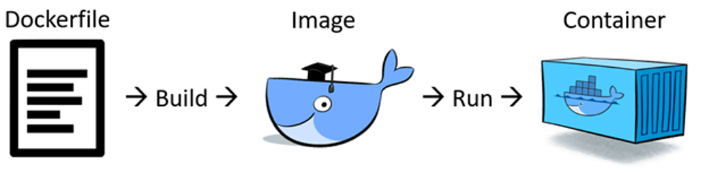

# docker-poc
Este projeto foi criado com o intuito de servir como insumo para praticar Docker.

# Docker
O Docker é uma extensão da tecnologia de virtualização de software LXC (LinuX Containers) presente no Linux, é uma camada que fornece recursos para gerenciamento dos containers. Temos como características deste modelo de virtualização:

* Compartilha recursos entre o root (kernel) e os containers, por este motivo não e um sistema de virtualização tradicional;
* Não necessita de um sistema operacional completo para as virtualização devido a característica supracitada;
* Possui vários níveis de isolamento;
* É uma engine de administração de containers, open source desenvolvido na linguagem GO;
* Os containers são menores, mais leves;
* Demanda menos recursos;

## Containers
Com base na definição do [site oficial](https://www.docker.com/resources/what-container) do Docker podemos definir um container como um ambiente isolado que é construído com base em uma imagem Docker, vários containers podem ser executados e uma maquinas. Seguindo as boas praticas é indicado que cada container siga o principio da responsabilidade única, ou seja, deve ser responsável por uma única aplicação.

## Imagens docker
Podemos defini-lo como um template, um modelo de sistemas de arquivos usado para criar um container. Podemos comparar uma imagem docker com uma estrutura de uma classe e um conteiner com um entidade instância, pois existe momentaneamente em memória.

O [Docker Hub](https://hub.docker.com/) e o repositório oficial das imagens Docker, podemos fazer uma abstração e analogia com o repositório do Maven.

## Docker Hub e Docker Registre
O Docker Hub e um serviço em nuvem que possui um registre, também podemos defini-lo como um provedor de registro. É um repositório de imagens, as imagens são criadas por usuário, parceiros e as imagens oficiais são criadas e mantidas pela própria equipe do Docker. O usuário do Docker Hub pode publicar suas imagens de forma pública ou privada (Limitada).

Docker Registre e um serviço de armazenamentos de imagens que pode ser em nuvem como o já citado [Docker Hub](https://hub.docker.com/), [Quay](https://quay.io/) , [Google Container Registry](https://cloud.google.com/container-registry/) e [Amazon Elastic Container Registry](https://aws.amazon.com/pt/ecr/). 
######Também e possível criar seu próprio registre.

##Volumes
Volumes são mapeamentos de pastas que podem ser criados entre o host e um container, também e possível criar mapeamentos em containers, mais informações podem ser vista na [documentação oficial](https://docs.docker.com/storage/volumes/).

##Arquitetura
Como podemos apreciar na imagem a seguir temos um estimulo inicial proveniente da interação de um cliente. Caso a imagem docker referida não exista na maquina local (Host) o Daemon ira recupera-la em uma repositório, o repositório oficial do docker e o Registry.

##Instalando o Docker
O Docker pode ser facilmente instalado conforme as orientações contidas em sua [documentação oficial](https://docs.docker.com/install/). Para testarmos a instalação e baixarmos a primeira imagem podemos seguir o exemplo abaixo:

Acesse o terminar e execute os comandos docker presente na imagem.

## Dockerfile

O Dockerfile nada mais é que um arquivo descritor, com base em sua descrição sera construída um imagem customizada. Esta imagem customizada tem como base uma imagem já existente, cadas comando de um arquivo descritor e uma camada a ser adicionada na imagem base.

## Docker Compose
O Docker Compouse e uma orquestrador de containers onde utilizamos um arquivo descritor "docker-compose" no formato YAML. Neste arquivo descrevemos os containers, regras de acesso, mapeamentos de uma aplicação.

Uma aplicação pode ser dividida em vários containers (backend, frontend, banco e etc... ) o que possibilita escalabilidade.

## Docker Cheat Sheet

## Referências
* [Site oficial do Docker](https://www.docker.com/).
* [Documentação oficial do Docker](https://docs.docker.com/engine/reference/run/).
* [Site Mundo Docker](https://www.mundodocker.com.br/o-que-e-dockerfile/).

